<div align="center">

# AdityaNet

**A verifiable research platform over the Aditya‑L1 solar X‑ray archive.**

*Every number on the site resolves to a committed artifact and a digest of the exact bytes it was read from.*

[](https://github.com/Rexy-5097/AdityaNet/actions/workflows/web.yml)
[](https://github.com/Rexy-5097/AdityaNet/actions/workflows/ci.yml)
[](./LICENSE)
[](https://astro.build)
[](https://www.typescriptlang.org)
[](https://adityanet-re1t.onrender.com)
[](#performance)

**[Live site →](https://adityanet-re1t.onrender.com)**  ·  [Findings](https://adityanet-re1t.onrender.com/findings/)  ·  [Data](https://adityanet-re1t.onrender.com/data/)  ·  [Reproduce](https://adityanet-re1t.onrender.com/build/reproduce/)

</div>

<div align="center">
  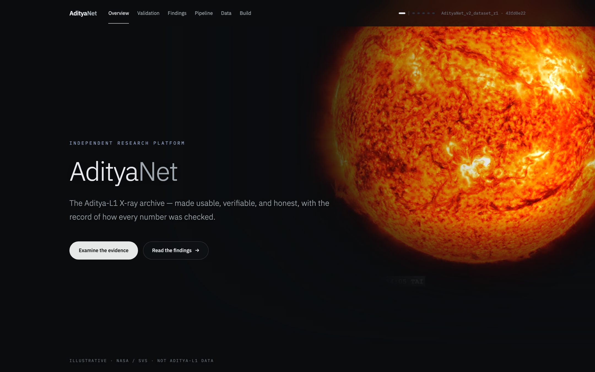
</div>

---

## What this is

AdityaNet is a static research platform built on a **frozen, digest‑addressed dataset** derived from two Aditya‑L1 X‑ray instruments — **SoLEXS** and **HEL1OS**. It publishes three things and nothing else:

1. **A canonical dataset** with a full provenance record.
2. **The validation history** — every time the implementation contradicted the written specification, and how each was ruled on.
3. **An honest scientific result**, including one that does not flatter the method.

**The headline result is negative.** On the evaluated flare‑detection tasks, machine‑learning models provide *no operational benefit* over a single threshold on the SoLEXS count rate. That result is presented at full weight, and it is reproducible from the committed artifacts.

> Why a negative result is the point: a platform whose central claim is *"our evidence is checkable"* earns that claim by publishing the finding that a positive‑result incentive would bury. The site is engineered so that a sceptic can verify every figure without trusting the prose.

### The engineering claim, stated precisely

- **No number is typed by a person.** Every rendered figure is resolved at build time from a committed JSON artifact by a code path, and a CI gate (`pnpm budget`) re‑reads those artifacts from disk and fails the build if a single rendered value drifts from its source.
- **Evidence surfaces ship ~0 KB of JavaScript.** Five of seven areas are pure HTML/CSS; the interactive charting island is isolated to one route. This is enforced by a per‑route byte budget in CI.
- **The site loads nothing from any external origin.** A strict, hash‑based Content‑Security‑Policy (`script-src 'self'` + build‑time SHA‑256 hashes, no `unsafe-inline`) is served in production and verifiable by reading the response headers.

---

## 30‑second orientation

| Question | Answer | Where it is proven |
| --- | --- | --- |
| **What is it?** | A verifiable research platform over the Aditya‑L1 X‑ray archive. | [`/overview`](https://adityanet-re1t.onrender.com/overview/) |
| **Why does it exist?** | To make the archive usable, and to publish a checkable scientific result — including a negative one. | [`/findings`](https://adityanet-re1t.onrender.com/findings/) |
| **Why is it credible?** | Every figure traces to an artifact + JSON pointer + digest; the validation record is public. | [`/validation`](https://adityanet-re1t.onrender.com/validation/) · [`/build`](https://adityanet-re1t.onrender.com/build/) |
| **What was found?** | ML did not beat a threshold detector; a spectral‑resolution ablation is a confirmed null. | [Research results](#research-results) |
| **How do I run it?** | `pnpm --dir web install && pnpm --dir web dev` | [Local development](#local-development) |
| **How do I reproduce the result?** | Rebuild the dataset and re‑run the benchmark against the frozen digest. | [Reproducibility](#reproducibility) |

---

## Contents

- [Screenshots](#screenshots)
- [Scientific overview](#scientific-overview)
- [Research results](#research-results)
- [Architecture](#architecture)
- [Diagrams](#diagrams)
- [Website tour](#website-tour)
- [Features](#features)
- [Technical stack](#technical-stack)
- [Repository structure](#repository-structure)
- [Local development](#local-development)
- [Reproducibility](#reproducibility)
- [Validation & quality gates](#validation--quality-gates)
- [Performance](#performance)
- [Design philosophy](#design-philosophy)
- [Roadmap](#roadmap)
- [Contributing](#contributing)
- [Citation](#citation)
- [License](#license)
- [Acknowledgements](#acknowledgements)

---

## Screenshots

Captured from the production build at fixed device profiles by [`web/scripts/screenshots.mjs`](web/scripts/screenshots.mjs), so they are reproducible rather than hand‑cropped.

### Findings — the verdict, made visible

The central claim is a *visual* one: the models' 95% confidence intervals overlap the threshold baseline's, so none is distinguishable from it.

<table>
  <tr>
    <td width="50%">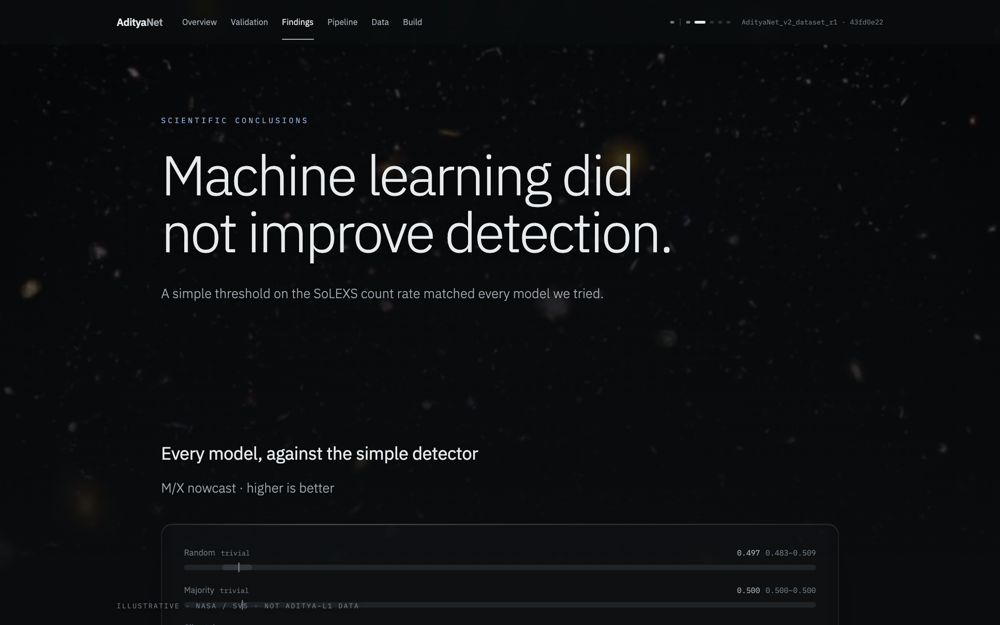</td>
    <td width="50%">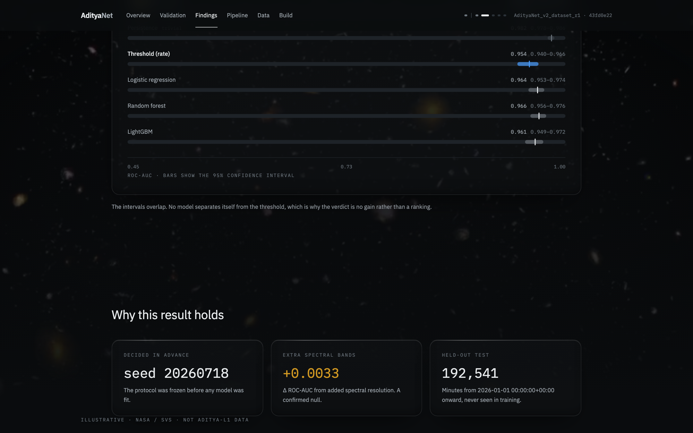</td>
  </tr>
</table>

### Data, Build, Validation, Pipeline

<table>
  <tr>
    <td width="50%">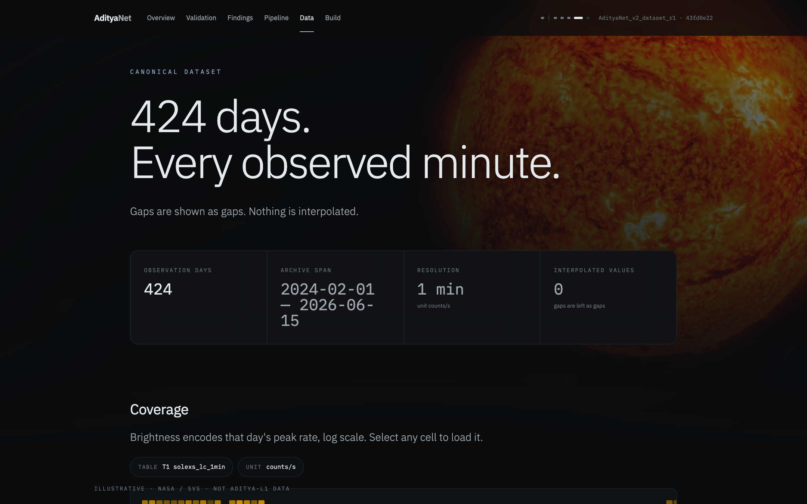</td>
    <td width="50%">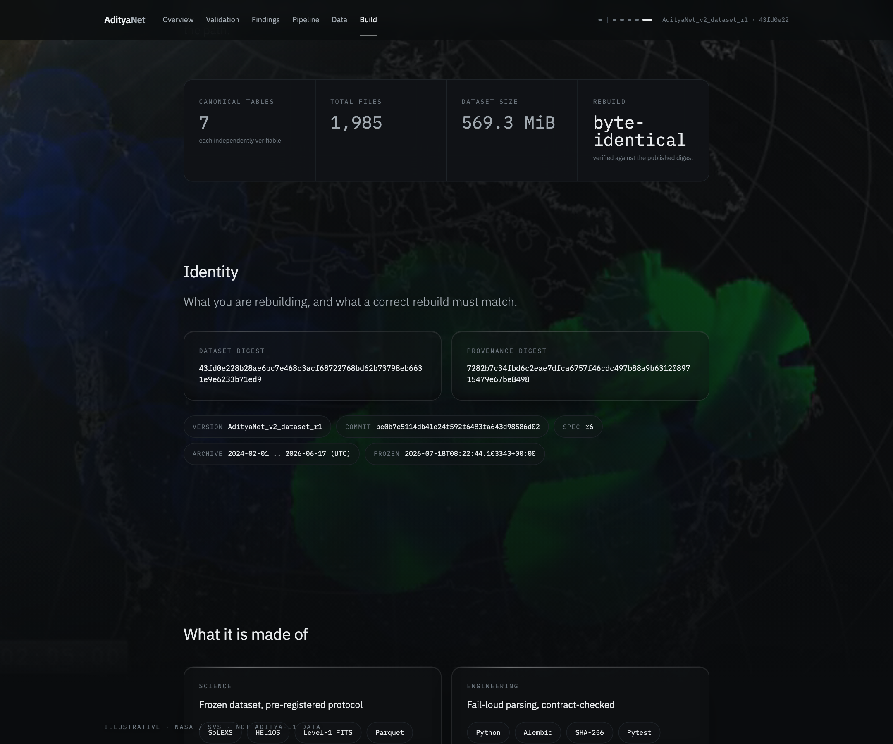</td>
  </tr>
  <tr>
    <td width="50%">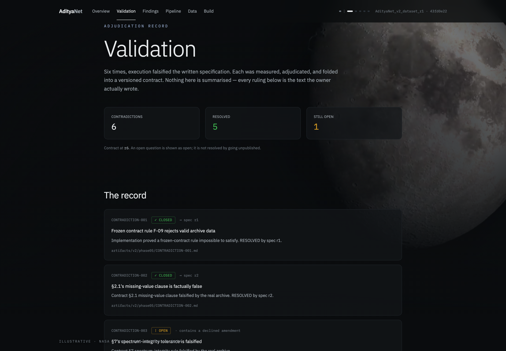</td>
    <td width="50%">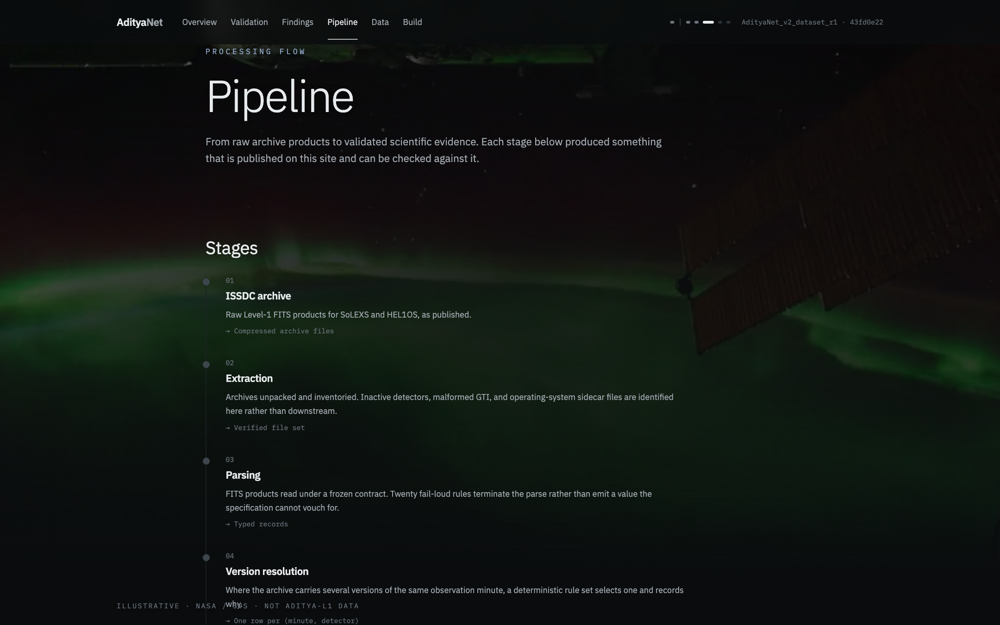</td>
  </tr>
</table>

### Responsive

The mobile experience is designed for the screen, not shrunk to fit it — navigation becomes a disclosure menu, and the hero recomposes so the footage sits above the copy on clean canvas.

<table>
  <tr>
    <td width="33%">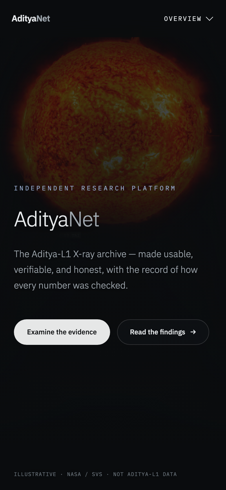</td>
    <td width="33%">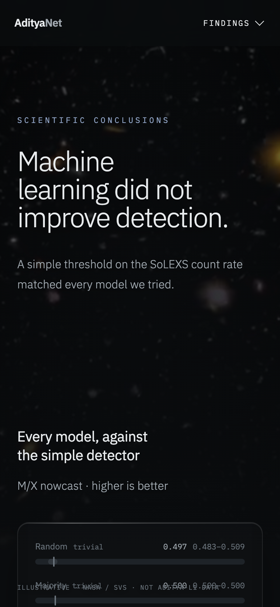</td>
    <td width="33%">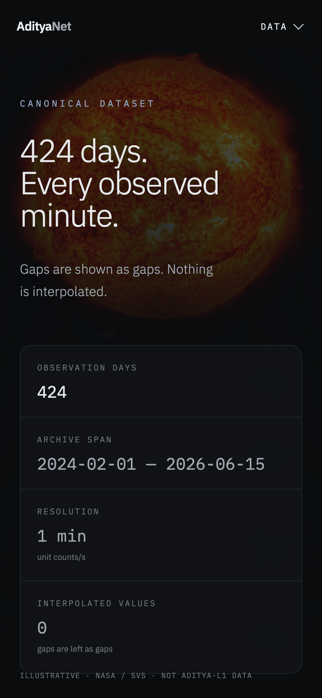</td>
  </tr>
</table>

---

## Scientific overview

**Mission — Aditya‑L1.** India's first dedicated solar observatory, stationed near the Sun–Earth L1 Lagrange point. Two of its payloads measure the solar soft X‑ray flux that rises and falls with flares:

- **SoLEXS** — Solar Low Energy X‑ray Spectrometer.
- **HEL1OS** — High Energy L1 Orbiting X‑ray Spectrometer.

**Data.** A frozen, versioned dataset (`AdityaNet_v2_dataset_r1`, digest `43fd0e22…`) derived from the SoLEXS and HEL1OS Level‑1 products, organised into **7 canonical tables** across **1,985 files** (**569.3 MiB**), spanning **2024‑02‑01 → 2026‑06‑17 (UTC)**. Provenance is published in full on the [Build](https://adityanet-re1t.onrender.com/build/reproduce/) surface, and every adjudicated deviation from spec is on [Validation](https://adityanet-re1t.onrender.com/validation/).

**Research question.** *Does machine learning provide measurable operational value beyond strong classical baselines* for M/X‑class flare **nowcast** (is a flare in progress now?) and **30‑minute prediction**, on this dataset?

**Methodology.** A protocol frozen *before any model was fit* — fixed seed, a time‑ordered held‑out test set (from 2026‑01‑01), and day‑block bootstrap confidence intervals to respect temporal correlation. Models (logistic regression, random forest, LightGBM) are compared against trivial baselines and a single‑threshold detector on the SoLEXS count rate.

**Finding.** *No.* For these tasks on this dataset, a simple count‑rate threshold is the strongest **non‑trivial** detector, and the learned models do not separate from it — their confidence intervals overlap. A follow‑up ablation adding spectral‑band features yields a **confirmed null** (ΔROC‑AUC ≈ +0.003).

**Limitations & reproducibility.** The result is scoped to the evaluated tasks and this frozen dataset; it is not a claim about flare physics or about ML in general. It is reproducible from the committed artifacts — see [Reproducibility](#reproducibility). Dataset provenance and every quality contradiction are published rather than summarised.

---

## Research results

**M/X‑class flare nowcast.** ROC‑AUC on the held‑out test set (**192,541** minutes; **581** M/X events; day‑block bootstrap 95% CIs; seed `20260718`). Higher is better; the axis begins at 0.5, where a coin flip sits.

| Model | ROC‑AUC | 95% CI | Class |
| --- | --- | --- | --- |
| Random | 0.497 | 0.483 – 0.509 | trivial baseline |
| Majority / Climatology | 0.500 | 0.500 – 0.500 | trivial baseline |
| **Threshold (count rate)** | **0.954** | **0.940 – 0.966** | **simple detector** |
| Logistic regression | 0.964 | 0.953 – 0.974 | learned |
| LightGBM | 0.961 | 0.949 – 0.972 | learned |
| Random forest | 0.966 | 0.956 – 0.976 | learned |
| Persistence | 0.982 | 0.978 – 0.986 | trivial baseline |

**How to read this table honestly.** The best learned model (random forest, 0.966) posts a *higher point estimate* than the threshold (0.954) — but their intervals overlap, so the difference is **not statistically distinguishable**. That is why the verdict is *"no gain"* rather than a ranking. Note also that **Persistence — a trivial baseline** ("it was flaring a minute ago, so it is flaring now") — scores highest of all: the nowcast task is dominated by short‑timescale autocorrelation, not by anything a model learns.

**Spectral‑resolution ablation (confirmed null).**

| Feature set | ROC‑AUC | Δ vs. T1‑only |
| --- | --- | --- |
| T1 (count rate) only | 0.9605 | — |
| T1 + spectral bands | 0.9638 | **+0.0033** |

Adding spectral resolution moves ROC‑AUC by ~0.003 — within noise. The added information does not translate into operational separation.

> Full benchmark tables for every task, the adjudicated verdicts rendered verbatim, and the frozen evaluation protocol live at **[/findings/method](https://adityanet-re1t.onrender.com/findings/method/)**. The numbers above are read from `artifacts/v2/ml/benchmark_results.json`; this README does not compute them.

---

## Architecture

AdityaNet is a **fully static site with no runtime server**. Every response is enumerable at build time, so the output is a plain directory that any CDN can serve indefinitely. Three decisions define the system; each is recorded as an ADR under [`docs/adr/`](docs/adr/).

| Decision | Why | ADR |
| --- | --- | --- |
| **No runtime server** | The site is evidence; evidence should be static, cacheable, and independently hostable. Nothing to exploit, nothing to keep running. | [0001](docs/adr/0001-no-runtime-server.md) |
| **Astro over Next.js** | Measured: a zero‑interaction page shipped 184 KB gz JS under Next (React always hydrates) vs 0 bytes under Astro islands. The evidence budget was unachievable on the Next floor. | [0002](docs/adr/0002-astro-over-nextjs.md) |
| **Two rendering domains** | *Artistic* (illustrative footage, always watermarked) is separated from *Measured* (traceable values) at the architecture level, so the two can never be confused. | [0003](docs/adr/0003-two-rendering-domains.md) |
| **Generated design tokens** | One source of truth for colour/type, emitted to both CSS variables and Tailwind, checked in CI so the two cannot drift. | [0004](docs/adr/0004-generated-design-tokens.md) |

The **evidence‑integrity pipeline** is the part worth studying: a derivation step reads the scientific artifacts and emits typed JSON; Astro renders that JSON at build time and tags each value with its source key; and `pnpm budget` closes the loop by re‑reading the artifacts and asserting the rendered HTML still matches. A number cannot be wrong on this site without failing the build.

Full detail: [`docs/architecture.md`](docs/architecture.md).

---

## Diagrams

### Application architecture

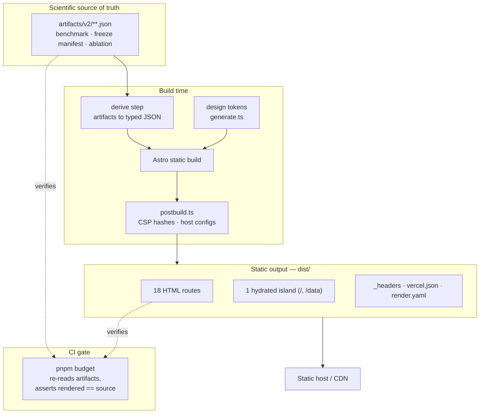

### User flow — the descent

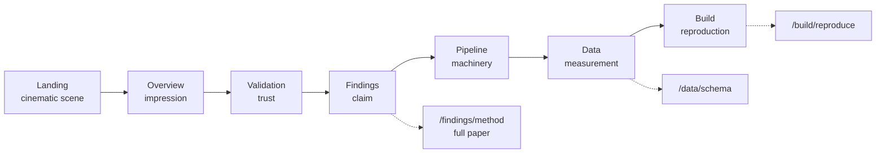

The navigation order is an argument: *validation precedes findings*, because the platform's claim is that its evidence is checkable, and the adjudication record is shown before the conclusions it underwrites.

### Scientific processing pipeline

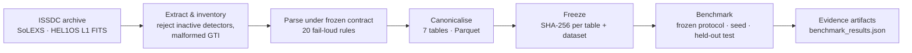

### Evidence‑integrity flow

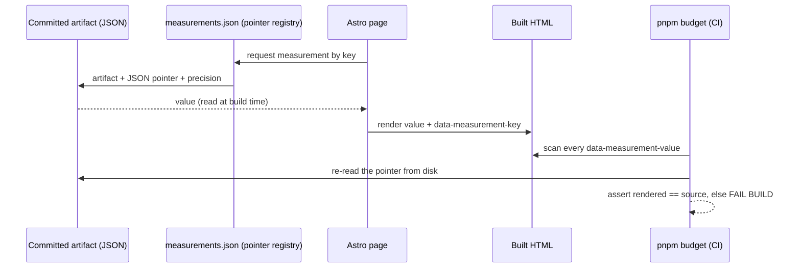

### Deployment architecture

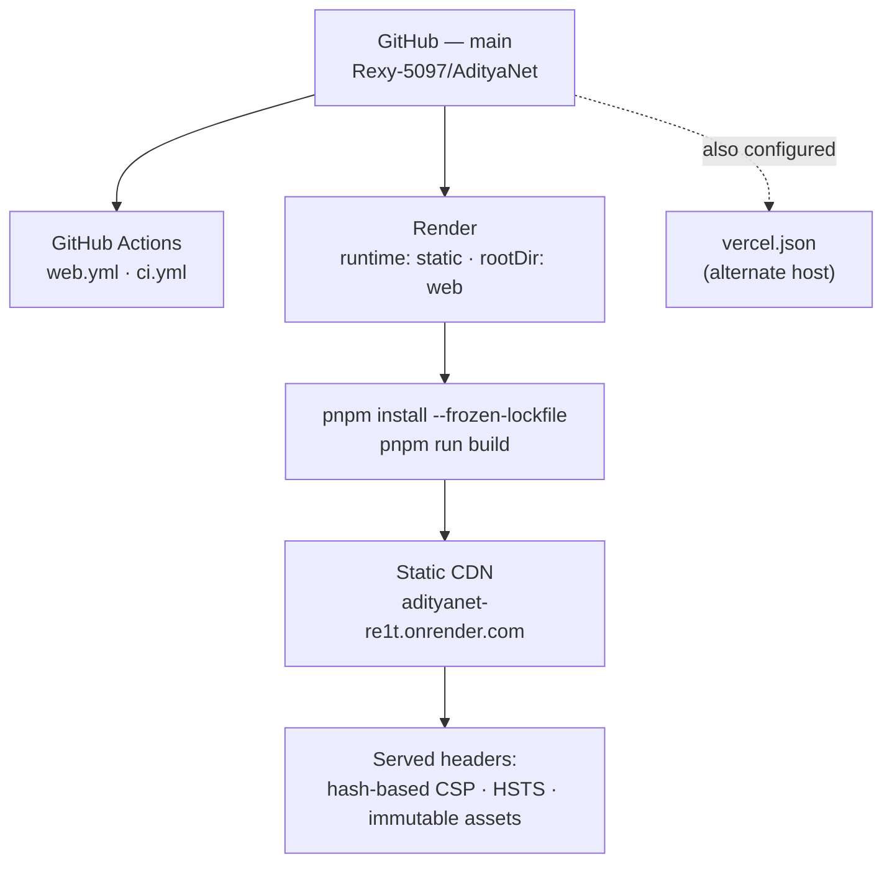

### Repository structure

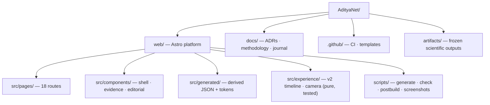

More diagrams (component relationships, documentation map) are in [`docs/architecture.md`](docs/architecture.md).

---

## Website tour

| Surface | Role | What it does |
| --- | --- | --- |
| **Landing** (`/`) | The film | A scroll‑scrubbed public‑domain SDO sequence driven by a pure `derive(t)` timeline. Sets the register: illustration, honestly labelled. |
| **Overview** (`/overview`) | Impression | The AdityaNet identity, the dataset chip, and six headline measurements — each a click from its source artifact. |
| **Validation** (`/validation`) | Trust | Six times the implementation falsified the written spec. Each is measured, adjudicated, and folded into a versioned contract — shown *before* the findings. |
| **Findings** (`/findings`) | Claim | The verdict at claim scale, a confidence‑interval comparison graphic, and evidence cards. The full method is one click away. |
| **Pipeline** (`/pipeline`) | Machinery | Raw archive products → validated evidence, stage by stage. |
| **Data** (`/data`) | Measurement | A coverage calendar over the whole archive and an interactive per‑day SoLEXS light curve. |
| **Build** (`/build`) | Reproduction | Capability cards, per‑table digests, the pinned environment, and the byte‑identical rebuild record. |

Documentation surfaces (`/findings/method`, `/data/schema`, `/build/reproduce`) carry the exhaustive detail, so the story surfaces stay scannable.

---

## Features

| Capability | Detail |
| --- | --- |
| Build‑time evidence resolution | Every figure read from a committed artifact via a JSON pointer; nothing hand‑typed. |
| Evidence‑consistency gate | CI re‑reads artifacts and fails the build if a rendered value drifts from source. |
| Per‑route JavaScript budgets | Enforced in CI; evidence routes measured at 0 KB. |
| Strict Content‑Security‑Policy | `script-src 'self'` + build‑time SHA‑256 hashes; no `unsafe-inline`; no external origins. |
| AAA contrast floors | Body text ≥ 7:1, enforced against generated tokens in CI. |
| Reproducible dataset | Digest‑addressed, per‑table hashes, pinned environment, published rebuild record. |
| Adjudicated validation record | Six spec/implementation contradictions published with their rulings. |
| Pure, unit‑tested experience core | The `derive(t)` timeline and camera subsystem are pure functions with invariant tests. |
| CSS‑only scroll choreography | Reveal and parallax via `animation-timeline`; zero JavaScript on evidence surfaces. |
| Responsive by design | Distinct mobile navigation and hero composition, verified 320 → 1920 px. |
| Reproducible screenshots | Documentation images captured from the production build by script. |
| Multi‑host deploy config | `render.yaml` and `vercel.json` generated from one header source, so the CSP cannot drift. |

---

## Technical stack

| Layer | Technology | Notes |
| --- | --- | --- |
| **Framework** | Astro 7.1 | Islands architecture; 0 KB JS by default. |
| **Language** | TypeScript 5 (`strictest`) | `noUncheckedIndexedAccess`, `exactOptionalPropertyTypes`. |
| **UI islands** | React 19 | Hydrated only where interaction is real (landing scene, light curve). |
| **3D / WebGL** | Three.js 0.185 · React Three Fiber 9 · `@react-three/postprocessing` | Landing‑scene compositing only. |
| **Motion** | GSAP 3.15 · Lenis 1.3 | Scroll‑scrubbed timeline; smooth scroll. |
| **Charting** | uPlot | Dense time‑series light curve; the one interactive evidence island. |
| **Styling** | Tailwind CSS 4 · generated design tokens | Tokens emitted to CSS vars + Tailwind from one source. |
| **Type** | IBM Plex Sans / Mono via Fontsource | Self‑hosted, subset, `woff2`; no font CDN. |
| **Scientific compute** | Python (dataset derivation, benchmark) | Frozen protocol; artifacts committed. |
| **Testing** | Vitest (78 tests) | Pure‑function invariants + WCAG contrast maths. |
| **Tooling** | pnpm · tsx · ESLint (with import‑boundaries) | Node ≥ 22.12. |
| **CI/CD** | GitHub Actions | `astro check`, tests, budget gate. |
| **Hosting** | Render (static) · Vercel‑configured | Zero runtime server. |

---

## Repository structure

```text
AdityaNet/
├── web/                          # The Astro platform (deployment root)
│   ├── src/
│   │   ├── pages/                # 18 routes — story + documentation surfaces
│   │   ├── components/           # shell/ · evidence/ · editorial/
│   │   ├── experience/v2/        # pure derive(t) timeline + camera (unit-tested)
│   │   ├── generated/            # derived JSON + design tokens (build inputs)
│   │   ├── layouts/ · styles/    # BaseLayout, flagship design language
│   │   └── scientific/           # LightCurve island
│   ├── scripts/                  # generate · check (budget) · postbuild · screenshots
│   ├── public/video/             # public-domain NASA/SVS footage (watermarked in-app)
│   ├── tokens/                   # design-token source (JSON)
│   ├── astro.config.mjs · vitest.config.ts
│   └── vercel.json               # generated host config (CSP-synced)
├── docs/
│   ├── adr/                      # architecture decision records (0001–0006)
│   ├── architecture.md · methodology.md · deployment.md
│   ├── reproducibility.md · design-system.md
│   ├── ENGINEERING_JOURNAL.md · ISSUE_LOG.md
│   └── web/                      # product spec, experience bible, integration plan
├── artifacts/                    # frozen scientific outputs (benchmark, manifests)
├── .github/
│   ├── workflows/                # web.yml · ci.yml
│   ├── ISSUE_TEMPLATE/
│   └── PULL_REQUEST_TEMPLATE.md
├── render.yaml                   # generated host config (CSP-synced)
├── CITATION.cff · CHANGELOG.md · CONTRIBUTING.md
├── CODE_OF_CONDUCT.md · SECURITY.md · LICENSE
└── README.md
```

> **Note.** This repository also contains an earlier server‑oriented data‑pipeline prototype at the root (Python). The **current, deployed product is `web/`**; the README, CI, and deployment configs all target it.

---

## Local development

**Prerequisites:** Node ≥ 22.12 and pnpm. The web app lives in `web/`.

```bash
# from the repository root
pnpm --dir web install          # install (uses the committed pnpm-lock.yaml)
pnpm --dir web dev              # dev server at http://localhost:4321
```

**Production build and verification:**

```bash
pnpm --dir web build            # astro build + postbuild (CSP hashes, host configs)
pnpm --dir web preview          # serve dist/ locally

pnpm --dir web verify           # generate --check + astro check + tsc + eslint
pnpm --dir web test             # vitest (78 tests)
pnpm --dir web budget           # contrast, route budgets, evidence consistency
```

**Environment variables:** none are required to build or run the site. It reads only committed files and fetches nothing at runtime.

**Regenerate documentation screenshots** (requires Playwright's Chromium):

```bash
pnpm --dir web build
node web/scripts/screenshots.mjs   # writes docs/assets/screenshots/*.png
```

---

## Reproducibility

A researcher can independently reproduce every published number:

1. **Rebuild the dataset** from the raw ISSDC Level‑1 products following the pinned environment and steps published on [`/build/reproduce`](https://adityanet-re1t.onrender.com/build/reproduce/).
2. **Verify integrity** — recompute the per‑table SHA‑256 digests and the dataset digest, and check them against the published values (dataset `43fd0e22…`). A correct rebuild is **byte‑identical**.
3. **Re‑run the benchmark** under the frozen protocol (fixed seed `20260718`, time‑ordered test set from 2026‑01‑01, day‑block bootstrap CIs). The evaluation is decided *before* fitting, so it cannot be tuned to a result.
4. **Compare** your `benchmark_results.json` against the committed artifact under `artifacts/v2/ml/`.

The website itself is reproducible too: `pnpm --dir web build && pnpm --dir web budget` re‑reads the artifacts and asserts every rendered value still matches. Full protocol: [`docs/reproducibility.md`](docs/reproducibility.md).

---

## Validation & quality gates

The build fails unless all of the following hold — discipline is enforced by tooling, not convention:

| Gate | Enforces |
| --- | --- |
| `astro check` + `tsc --noEmit` | Types, under the `strictest` profile. |
| `vitest` (78 tests) | `derive(t)` purity, monotonic certainty, watermark sequencing, camera invariants (no roll, static shots provably static), WCAG contrast maths. |
| **Evidence consistency** | Every rendered measurement re‑read from its artifact; build fails on any drift. |
| **Route budgets** | Per‑route gzipped‑JS ceilings; evidence routes must stay at 0 KB. |
| **Contrast floors** | Body text ≥ 7:1 (AAA) against the generated tokens. |
| **Banned lexicon** | Marketing / over‑claiming vocabulary rejected across all pages. |
| **Measurement literals** | No numeric literal may masquerade as a measurement in a template. |
| ESLint import boundaries | Architectural layering (evidence code cannot import experience code, etc.). |

The **[Validation](https://adityanet-re1t.onrender.com/validation/)** surface publishes the six times the implementation contradicted the specification, each with the ruling that resolved it — the audit trail behind the trust claim. See also [`docs/ISSUE_LOG.md`](docs/ISSUE_LOG.md).

---

## Performance

Measured from the production build (`pnpm --dir web budget`):

| Route | JS shipped (gz) | Budget | Scripts |
| --- | --- | --- | --- |
| `/` (landing scene) | 107.0 KB | 450 KB | 4 |
| `/data` (light‑curve island) | 58.4 KB | 260 KB | 5 |
| `/overview` · `/findings` · `/pipeline` · `/build` · `/validation` | **0.0 KB** | — | 0 |

**Strategy.** JavaScript is spent only where interaction is real. The landing scene (scroll‑scrubbed video + WebGL compositing) and the `/data` light curve are the only islands; every evidence surface is static HTML with CSS‑only scroll choreography (`animation-timeline`). Hashed assets are served `immutable`; the ambient videos are transcoded, audio‑stripped loops (largest 6.3 MB, lazy). The CSP forbids external origins, so there is no third‑party script or font tax.

> The Lighthouse *number* has not been captured in a controlled run, so none is quoted here — the byte budgets above are measured facts. Running Lighthouse against the live URL is on the [roadmap](#roadmap).

---

## Design philosophy

**Story is separated from documentation.** Each evidence area is two surfaces: a scannable *story* page (a verdict, one supporting sentence, a few visual elements) and a *documentation* page carrying the exhaustive tables and protocol. A visitor understands each section in seconds; a reviewer clicks through to the full record. Neither compromises the other.

**Two registers, never confused.** *Artistic* content (real solar footage) is always watermarked `ILLUSTRATIVE · NASA / SVS · NOT ADITYA‑L1 DATA` and is architecturally separate from *Measured* content (traceable values). Illustration may be beautiful; it may never masquerade as data.

**Visual communication first.** The negative result is shown, not argued: overlapping confidence bands make *"no gain"* legible before the caption is read. Restraint is the signal — the measured register carries no decorative effects, because post‑processing a measurement would be a visual lie about its provenance.

Full detail: [`docs/design-system.md`](docs/design-system.md) and [`docs/web/EXPERIENCE_BIBLE.md`](docs/web/EXPERIENCE_BIBLE.md).

---

## Roadmap

**Near term**
- [ ] Capture a controlled Lighthouse run against the live URL and publish the report.
- [ ] Real‑device testing pass (iOS Safari `svh` / toolbar behaviour, touch on the light curve).
- [ ] Apply the story / documentation split to `/validation` and `/pipeline`.

**Medium term**
- [ ] Expand the benchmark to additional flare classes and prediction horizons.
- [ ] Publish the dataset‑derivation code alongside the frozen artifacts.
- [ ] Add an automated visual‑regression check to CI using the screenshot script.

**Long term**
- [ ] Package the evidence‑integrity pipeline (artifact → typed JSON → CI consistency gate) as a reusable library.
- [ ] Extend to further Aditya‑L1 payloads as archive coverage grows.

---

## Contributing

Contributions are welcome. Please read [`CONTRIBUTING.md`](CONTRIBUTING.md) first — the non‑negotiable rule is that **the quality gates are the contract**: no number is hand‑typed, evidence must trace to an artifact, and the CI budget / consistency gates must pass. Development uses feature branches and conventional‑style commits; see the guide for the workflow and PR checklist.

By participating you agree to the [Code of Conduct](CODE_OF_CONDUCT.md). Security issues: see [`SECURITY.md`](SECURITY.md).

---

## Citation

If you reference AdityaNet or its negative result, please cite it. Machine‑readable metadata is in [`CITATION.cff`](CITATION.cff).

**BibTeX**

```bibtex
@software{adityanet_2026,
  title        = {AdityaNet: A Verifiable Research Platform over the Aditya-L1 Solar X-Ray Archive},
  author       = {Tripathy, Soumyadeb},
  year         = {2026},
  url          = {https://github.com/Rexy-5097/AdityaNet},
  note         = {Dataset AdityaNet\_v2\_dataset\_r1, digest 43fd0e22}
}
```

**APA**

> Tripathy, S. (2026). *AdityaNet: A verifiable research platform over the Aditya‑L1 solar X‑ray archive* [Software]. https://github.com/Rexy-5097/AdityaNet

---

## License

Released under the [MIT License](LICENSE) for the source code.

Solar and space footage is public‑domain imagery from **NASA / NASA's Scientific Visualization Studio (SVS)**, used illustratively and watermarked as such throughout the site; it is not Aditya‑L1 data. Aditya‑L1 archive products are governed by their originating institutions' terms.

---

## Acknowledgements

- **ISRO** and the **ISSDC** for the Aditya‑L1 mission and the public SoLEXS / HEL1OS archive.
- **NASA** and the **Scientific Visualization Studio** for the public‑domain solar and space visualizations used illustratively.
- The open‑source projects this platform is composed from — **Astro**, **React**, **Three.js** and the React Three Fiber ecosystem, **GSAP**, **Lenis**, **uPlot**, **Tailwind CSS**, **Vitest**, and **IBM Plex** via Fontsource.

> **Affiliation firewall.** AdityaNet is an independent research project. It is **not** affiliated with, endorsed by, or operated by ISRO, NASA, or any space agency. It is built on publicly available archive data.
