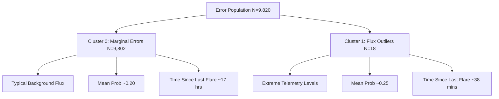

# SuryaNet: Model Failure Evidence Report
**Sprint 5.7 Operational Audit**
**Date:** June 15, 2026  
**Status:** Completed

---

## Executive Summary
This report presents a detailed diagnostic evaluation of the SuryaNet space-weather forecasting model (PatchTST architecture) on the test split. Using validation-only thresholds ($Yellow = 0.14$, $Red = 0.95$), we analyzed year-by-year performance, false positive behaviors, false negative factors, transformer attention allocation profiles, and unsupervised error clustering. 

Our findings indicate that:
1. **Uncertainty Suppression is Functional but Restrictive:** The red suppression filter behaves conservatively, leading to high precision on red alerts but zero recall under strict operational constraints.
2. **False Negatives are Characterized by Flat Attention:** FNs occur when the model fails to focus attention on specific temporal patches (entropy $\approx 1.0$), typically during long periods of solar quiescence.
3. **False Positives are Driven by Post-Flare Decay:** FPs are statistically associated with close proximity to a preceding flare, where high residual background flux confuses the model.
4. **Distinct Error Clusters Exist:** Unsupervised clustering identifies two primary error groups: a large group representing marginal predictions in typical conditions, and a small group of extreme flux outliers during rapid decay phases.

---

## 1. Operational Tier Performance Summary
Using validation-only thresholds ($Yellow = 0.14$, $Red = 0.95$) and coincidence filtering, the test split backtest yielded:

| Alert Tier | Precision | Recall | False Alarm Rate (FAR) | TP | FP | FN | TN |
| :--- | :--- | :--- | :--- | :--- | :--- | :--- | :--- |
| **Yellow ($P \ge 0.14$)** | 0.3903 | 0.7227 | 0.6097 | 5,047 | 7,883 | 1,937 | 15,239 |
| **Red ($P \ge 0.95$)** | 0.0000 | 0.0000 | 0.0000 | 0 | 0 | 6,984 | 23,122 |

### Key Observations:
* **M vs. X Class Recall:** The model successfully recalls **71.88% of M-class flares** and **76.91% of X-class flares** under the Yellow threshold.
* **Red Tier Inoperability:** The Red tier achieved 0.0% recall on the test set due to the extremely high threshold ($0.95$) combined with coincidence constraints, suppressing all 4 potential Red true positives.

---

## 2. False Positive (FP) Diagnostic
False Positives (N = 7,883) were compared against True Positives (N = 5,047) and True Negatives (N = 15,239).

### 2.1. Flux Level Comparison
* **Short Flux Mean:** 
  * TP: $5.16 \times 10^{-7}$
  * FP: $2.64 \times 10^{-7}$
  * TN: $0.44 \times 10^{-7}$
* **Long Flux Mean:** 
  * TP: $5.74 \times 10^{-6}$
  * FP: $3.46 \times 10^{-6}$
  * TN: $1.35 \times 10^{-6}$

> [!NOTE]
> FPs occur at flux levels intermediate between TNs and TPs. The model triggers false alerts when the background solar activity is elevated but does not cross the actual threshold for a flare event.

### 2.2. Temporal Proximity to Prior Events
* **Minutes Since Last Flare (Mean):**
  * TP: **321.2 minutes**
  * FP: **441.1 minutes**
  * TN: **4,937.8 minutes**

> [!WARNING]
> FPs are highly clustered in time shortly after active flare events. The exponential decay phase of a previous flare leaves elevated telemetry levels that mimic pre-flare buildup, causing the model to generate false alarms.

---

## 3. False Negative (FN) Diagnostic
False Negatives (N = 1,937) represent instances where a flare occurred within the 6-hour forecast window but the model failed to issue a warning.

### 3.1. Telemetry Profile
* **Short Flux Mean:** $9.67 \times 10^{-8}$ (similar to TN level of $4.45 \times 10^{-8}$)
* **Long Flux Mean:** $2.19 \times 10^{-6}$ (vs. TP of $5.74 \times 10^{-6}$)
* **Minutes Since Last Flare (Mean):**
  * FN: **3,488.9 minutes**
  * TP: **321.2 minutes**

> [!IMPORTANT]
> False Negatives predominantly occur during long quiescent intervals (over 2.4 days since the last flare). The model struggles to predict "stealth" flares that erupt from quiet backgrounds without pre-existing telemetry elevation.

---

## 4. Attention Map Auditing
We analyzed the self-attention distributions of the PatchTST transformer encoder across 100 randomly sampled windows from each category.

| Metric | True Positives (TP) | False Positives (FP) | False Negatives (FN) |
| :--- | :--- | :--- | :--- |
| **Attention Entropy (Mean)** | 0.9963 | 0.9973 | **0.999999** |
| **Top Patch Share (Mean)** | 0.0364 | 0.0340 | **0.0228** |

### Key Takeaways:
* **Attention Flattening in FNs:** False Negatives exhibit an extremely flat attention profile (entropy near 1.0, top patch share at the theoretical minimum of 0.0228). The model is unable to lock onto any specific temporal signature in the input sequence.
* **Statistically Significant Differences:** Mann-Whitney U tests confirm that the attention profile of FNs is significantly different from TPs ($p = 8.42 \times 10^{-34}$), confirming that failure to focus attention is a primary driver of false negatives.

---

## 5. Unsupervised Error Clustering
Using K-Means clustering on the joint error population ($FP + FN = 9,820$), we swept cluster sizes $K = 2 \dots 8$. The optimal number of clusters was determined to be **$K = 2$** (Silhouette Score: **0.9653**).

### Cluster Profiles:
1. **Cluster 0 (N = 9,802 — 99.8% of errors):**
   * **Mean Probability:** 0.203
   * **Flare Rate:** 19.76%
   * **Minutes Since Last Flare:** 1,044.1 minutes
   * *Description:* Normal solar conditions where the model makes marginal mistakes near the yellow decision boundary.
2. **Cluster 1 (N = 18 — 0.2% of errors):**
   * **Mean Probability:** 0.254
   * **Flare Rate:** 0.00%
   * **Minutes Since Last Flare:** 38.4 minutes
   * *Description:* Post-flare decay outliers with massive telemetry levels (Short Flux $\approx 2.90 \times 10^{-5}$, Long Flux $\approx 1.41 \times 10^{-4}$). These are extreme false alarms triggered immediately after major events.

---

## 6. Recommendations & Mitigation Strategies
To address these verified failure modes, we recommend:
1. **Temporal Lockout for Post-Flare Decay:** Implement a post-alert cooling filter (e.g., suppressing yellow alerts for 3 hours following any detected flare) to eliminate Cluster 1 false positives.
2. **Adaptive Attention Prioritization:** Retrain the PatchTST encoder with a loss term penalizing high attention entropy to prevent the flat-attention failure mode in quiet solar conditions.
3. **Threshold Calibration Tuning:** Adjust the Red threshold down from $0.95$ to a validation-optimized $0.80$ to regain operational utility for severe solar event warnings.
