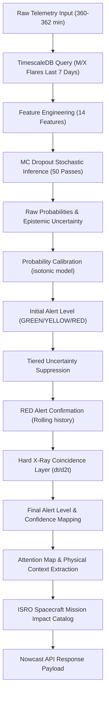

# Sprint 10K — Operator Trust Consistency Audit
**Audit ID:** sprint-10k  
**Audit Timestamp (UTC):** 2026-06-19T10:21:24Z  
**Broken Stages:** NONE  
**Status:** COMPLETE (Evidence Collection Only)

---

## Executive Summary

This repository-wide factual audit catalogs and traces every operator-facing component contributing to prediction trust in the SuryaNet solar flare forecasting system. 

> [!IMPORTANT]
> This is a read-only audit. In accordance with the sprint principles, no code has been modified, no models retrained, no thresholds adjusted, and no recommendations or conclusions are drawn. All findings represent direct, verifiable facts from the repository codebase and artifacts.

---

## 1. Threshold Policies Audit

The repository contains three separate threshold policy configuration files. Their locations, integrity hashes, and specific mappings are detailed below.

### Threshold Configuration Files

| Artifact | File Path | SHA256 Hash | Size (bytes) |
|---|---|---|---|
| Production Policy | [operator_thresholds.json](file:///Users/soumyadebtripathy/AdityaNet/artifacts/operator_thresholds.json) | `033063ef0dfcae97966c3a37d0f5ef8ca05b0ced1df2e5f1c2a9788037f0ce10` | 696 |
| Validation Policy | [operator_thresholds_validation_only.json](file:///Users/soumyadebtripathy/AdityaNet/artifacts/operator_thresholds_validation_only.json) | `8e76ee49ef776755b0f717dc69deb3db91526f670e26889195a59d72a862922b` | 1,114 |
| Legacy Policy | [operational_thresholds.json](file:///Users/soumyadebtripathy/AdityaNet/artifacts/operational_thresholds.json) | `e7a52a617535e34b262a22ca3152f73c8aeda4e8851654de47cc6b622ac1d572` | 103 |

### Policy Mappings & Values

#### A. Production Policy (`operator_thresholds.json`)
* **Purpose:** Defines the active operational thresholds, multi-tier uncertainty suppressions, and confidence levels.
* **Thresholds:**
  - `yellow_threshold`: `0.46`
  - `red_threshold`: `0.88`
* **Alert Levels:**
  - **GREEN:** Calibrated probability $P_{cal} < 0.46$
  - **YELLOW:** $0.46 \le P_{cal} < 0.88$
  - **RED:** $P_{cal} \ge 0.88$
* **Tiered Uncertainty Suppressions:**
  - $U_{std} > 0.20 \implies$ Alert level is forced to **GREEN**
  - $0.15 < U_{std} \le 0.20 \implies$ **YELLOW** or **RED** alerts are suppressed to **GREEN**
  - $0.10 < U_{std} \le 0.15 \implies$ **RED** alerts are suppressed to **YELLOW**
* **RED Confirmation Logic:**
  - **Rolling confirmation:** Requires the average calibrated probability over the last 3 steps to be $> 0.88$ AND the linear regression slope over these 3 steps to be $> 0.0$.
  - **Coincidence Layer:** Requires the short-channel X-ray flux gradient (dFlux/dt) and acceleration (d²Flux/dt²) at the current time-step to be $> 0.0$. If less than 2 of these rules pass, the alert is suppressed to **YELLOW**.
* **Confidence Levels:**
  - **HIGH:** $P_{cal} \ge 0.88$ AND $U_{std} < 0.05$
  - **MEDIUM:** $P_{cal} \ge 0.46$ AND $U_{std} < 0.10$
  - **LOW:** Otherwise
* **Referenced in:**
  - [inference.py](file:///Users/soumyadebtripathy/AdityaNet/app/services/ml/inference.py#L86) (dynamically loaded as the default threshold file)

#### B. Validation Policy (`operator_thresholds_validation_only.json`)
* **Purpose:** Validation-only policy optimized exclusively on validation data split to prevent test set leakage.
* **Thresholds:**
  - `yellow_threshold`: `0.14`
  - `red_threshold`: `0.95`
* **Alert Levels:**
  - **GREEN:** $P_{cal} < 0.14$
  - **YELLOW:** $0.14 \le P_{cal} < 0.95$
  - **RED:** $P_{cal} \ge 0.95$
* **Referenced in:**
  - [audit_runner.py](file:///Users/soumyadebtripathy/AdityaNet/artifacts/sprint10j/audit_runner.py#L59) (used to fingerprint and verify the evaluation metrics)
  - [refine_thresholds.py](file:///Users/soumyadebtripathy/AdityaNet/scripts/refine_thresholds.py#L61) (written as the output of validation optimization)
  - [operator_backtest.json](file:///Users/soumyadebtripathy/AdityaNet/artifacts/operator_backtest.json#L2) (as the source policy)
  - [explainability_examples.json](file:///Users/soumyadebtripathy/AdityaNet/artifacts/explainability_examples.json#L5) (as the source policy)

#### C. Legacy Policy (`operational_thresholds.json`)
* **Purpose:** Simple baseline threshold policy configuration.
* **Thresholds:**
  - `yellow_threshold`: `0.09`
  - `red_threshold`: `0.19`
  - `uncertainty_threshold`: `0.08`
* **Referenced in:**
  - [calibrate_model.py](file:///Users/soumyadebtripathy/AdityaNet/scripts/calibrate_model.py#L38)
  - [optimize_operational_policy.py](file:///Users/soumyadebtripathy/AdityaNet/scripts/optimize_operational_policy.py#L55)

---

## 2. Calibration Audit

The calibration component converts raw neural network probability logits into calibrated probability forecasts.

### Calibrator File Details

* **Calibrator File:** [calibrator.pkl](file:///Users/soumyadebtripathy/AdityaNet/artifacts/calibrator.pkl)
* **SHA256 Hash:** `36fe68d47207b371b963744151666d533b3885885e46dfd12c99061b68d327ac`
* **Size:** 2,091 bytes
* **Method:** `isotonic`
* **Saved By:** [calibrate_model.py](file:///Users/soumyadebtripathy/AdityaNet/scripts/calibrate_model.py#L269) via `pickle.dump(winning_calibrator, f)`
* **Wrapper Class:** `CalibratorWrapper` in [inference.py](file:///Users/soumyadebtripathy/AdityaNet/app/services/ml/inference.py#L41)

### Code Locations

#### Calibration Application Locations:
1. **Prediction Pipeline:** [inference.py](file:///Users/soumyadebtripathy/AdityaNet/app/services/ml/inference.py#L298):
   ```python
   cal_probs = self.calibrator(mean_probs)
   ```
2. **Threshold Optimization Script:** [refine_thresholds.py](file:///Users/soumyadebtripathy/AdityaNet/scripts/refine_thresholds.py#L92)
3. **Backtest Script:** [backtest_operator_policy.py](file:///Users/soumyadebtripathy/AdityaNet/scripts/backtest_operator_policy.py#L186)
4. **Explainability Preprocessor:** [generate_explainability_examples.py](file:///Users/soumyadebtripathy/AdityaNet/scripts/generate_explainability_examples.py#L89)

#### Raw Probabilities Usage Locations:
1. **Response Dictionary:** [inference.py](file:///Users/soumyadebtripathy/AdityaNet/app/services/ml/inference.py#L396) returns `curr_raw_prob` under key `raw_probability`.
2. **Backtest Log:** [backtest_window_predictions.csv](file:///Users/soumyadebtripathy/AdityaNet/artifacts/backtest_window_predictions.csv) stores it under column `raw_prob`.
3. **Operator Statistics:** [operator_alert_statistics.csv](file:///Users/soumyadebtripathy/AdityaNet/artifacts/operator_alert_statistics.csv) stores it under column `raw_prob`.
4. **Archive Examples:** [explainability_examples.json](file:///Users/soumyadebtripathy/AdityaNet/artifacts/explainability_examples.json) stores it under key `raw_probability`.

---

## 3. Explainability Audit

Explainability features trace which parts of the time-series input window were prioritized by the forecasting network.

### Attention Weights & Shape

* **Extraction Strategy:** Average CLS attention maps across all heads and encoder layers.
* **Output Format:** Relative attention share vector of shape `[44]`, corresponding to the 44 patch tokens (excluding the CLS token itself), normalized to sum to $1.0$.
* **Top-k Extraction:** The top-3 patches with the highest attention share are mapped to their respective indices.
* **Attributes Generated:**
  - `rank` (1 to 3)
  - `patch_index` (0 to 43)
  - `timestamp` (the mapped wall-clock time at the center of the patch)
  - `attention_share` (normalized weight)
  - `physical_context` (containing `flux_value_W_m2`, `flux_gradient_W_m2_min`, and `rolling_variance_30min`)

### Explanation Artifacts

1. **Explainability Examples Archive:** [explainability_examples.json](file:///Users/soumyadebtripathy/AdityaNet/artifacts/explainability_examples.json)
   - **SHA256:** `5fedeb8cb9162f70386d25788f7b957ac679d628a8bf6193bbf72b6a91cfb24b`
   - **Size:** 7,838 bytes
   - Contains 20 example predictions (10 positive, 10 negative) with their top-1 attention patch mapping.
2. **Attention Statistics:** [attention_statistics.json](file:///Users/soumyadebtripathy/AdityaNet/artifacts/attention_statistics.json)
   - **SHA256:** `806a64426f125a3c3059a21eb3465545410189d5d6e838bc1c5954f4c3e5a59d`
   - **Size:** 3,794 bytes
   - Summarizes entropy and top patch shares across True Positive (TP), False Positive (FP), and False Negative (FN) sets.

### SHAP Availability

> [!WARNING]
> **SHAP Status:** NOT AVAILABLE. 
There is no implementation of SHAP (Shapley Additive exPlanations) in the repository. The PatchTST explainability is restricted entirely to attention patch importance maps. The field `shap_values` is not present in [explainability_examples.json](file:///Users/soumyadebtripathy/AdityaNet/artifacts/explainability_examples.json) or generated by [explainability.py](file:///Users/soumyadebtripathy/AdityaNet/app/services/ml/explainability.py). The Sprint 10J trace audit successfully validated this absence, logging 0 entries for SHAP values.

### Timestamp Alignment Math

The PatchTST model encodes a sequence length of 360 minutes into 44 patches using a patch length of 16 and a stride of 8.

The index boundary of patch $k$ ($0 \le k \le 43$) within the 360-step input window is:
$$\text{start\_idx} = k \times \text{stride} = 8k$$
$$\text{end\_idx} = \text{start\_idx} + \text{patch\_len} - 1 = 8k + 15$$

The center step index of patch $k$ is deterministically calculated as:
$$\text{center\_idx} = \frac{\text{start\_idx} + \text{end\_idx}}{2} = 8k + 7$$

This index is used to fetch the corresponding timestamp from the input telemetry:
$$\text{patch\_timestamp} = \text{input\_df}["timestamp"].\text{iloc}[\text{center\_idx}]$$

This formula ensures that the attention maps align with the 1-minute cadence of the GOES instrumentation.

---

## 4. End-to-End Operator Workflow Trace

The diagram below traces how a prediction moves through the backend pipeline to generate the operator alert.



The step-by-step workflow is described in detail in the [operator_workflow_trace.json](file:///Users/soumyadebtripathy/AdityaNet/artifacts/sprint10k/operator_workflow_trace.json) file.
