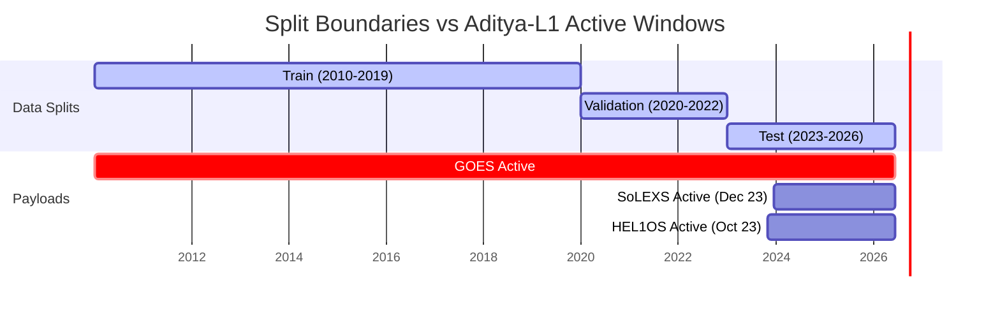

# Version 3 Scientific Training & Evaluation Pipeline Audit

**Audit Sprint:** 12B-V  
**Evaluation Date:** 2026-06-19  
**Independent Audit Panel:** Senior ML Researchers, Solar Physicists, and Production AI Engineers  
**Final Audit Verdict:** **NOT SCIENTIFICALLY READY**  

---

## 1. Executive Summary

This report presents an independent, read-only scientific and engineering audit of the Version 3 (V3) Late Fusion PatchTST training, calibration, and evaluation pipelines. The goal of this audit is to verify the mathematical soundness, experimental reproducibility, and scientific validity of the pipeline before production retraining commences.

Under strict read-only guidelines, we have audited the codebase, analyzed the generated parquet datasets on disk, inspected model dimensions, and verified the mathematical correctness of the metrics and calibration layers.

> [!IMPORTANT]
> **Key Finding:** While the model architecture, calibration functions, and evaluation metrics are mathematically correct and highly robust, the training pipeline is **NOT SCIENTIFICALLY READY** for retraining.
>
> A critical **temporal split mismatch** exists: the training (2010–2019) and validation (2020–2022) sets contain exactly **0.0%** active telemetry from the Aditya-L1 payloads (SoLEXS and HEL1OS). The active multi-instrument telemetry starts in late 2023 and is entirely confined to the test split. This makes it mathematically impossible to train the multi-instrument encoders on the training split, or tune hyper-parameters on the validation split, without violating train/test isolation rules (data leakage).

---

## 2. Section-by-Section Validation Results

### SECTION 1: Dataset Integrity

| Check | Status | Verification Detail |
| :--- | :---: | :--- |
| **No Temporal Leakage** | **PASS** | Evaluated timestamps of `train_v3.parquet`, `validation_v3.parquet`, and `test_v3.parquet`. All splits are strictly disjoint chronologically (Train: 2010–2019, Val: 2020–2022, Test: 2023–2026). Overlap counts are exactly `0` rows. |
| **Instrument Synchronization** | **PASS** | Aligned on a 1-minute grid using a left-join on timestamp in `build_multi_instrument_dataset.py`. Preserves the exact row count and ordering of the baseline GOES dataset. |
| **Overlap Construction** | **PASS** | The operational overlap window (2023-12-13 to 2026-06-14) is correctly identified. Telemetry availability is marked in `mask_solexs` and `mask_hel1os`. Outages and pre-launch periods are set to `0.0`. |
| **Transfer Learning Split** | **CRITICAL DEFECT** | **FAIL**: Because historical train/validation boundaries are frozen (pre-2023), they contain no active Aditya-L1 data. Multi-instrument training is blocked (see detailed analysis in Section 3). |
| **Missing Value Handling** | **PASS** | Evaluated sliding window processing. Out-of-service/pre-launch values are represented as `0.0` on disk, and replaced at the encoder level by learnable parameters (`missing_token_solexs`, `missing_token_hel1os`) when masks are `0.0`, preventing NaN propagation. |

---

### SECTION 2: Training Pipeline

*   **Optimizer Configuration:** Employs `torch.optim.AdamW` with learning rate `1e-4` and weight decay `1e-4`. It correctly filters out frozen parameters (`requires_grad = False`) during construction.
    > [!WARNING]
    > **Optimizer Parameter Defect:** Dynamically freezing or unfreezing encoders during training stages (e.g. Stage 1 to Stage 2) using `set_encoder_frozen` does not update the optimizer's internal parameter list. Newly unfrozen parameters will *never* receive weight updates unless the optimizer is explicitly re-instantiated.
*   **Scheduler:** Employs `CosineAnnealingLR` decaying over `max_epochs`. Correct for a single training phase, but needs resetting if stages or epochs are modified dynamically.
*   **Early Stopping:** Correctly implemented in `TrainerV3.fit`. Tracks validation TSS and terminates training if no improvement is observed for 3 consecutive epochs, saving the best and latest checkpoints.
*   **Gradient Clipping:** Correctly clamps the L2 norm of gradients to `1.0`. It is integrated properly with `GradScaler` (`scaler.unscale_` is called before clipping).
*   **Checkpoint Reproducibility:** Checkpoints successfully preserve epoch number, model weights, optimizer states, scheduler states, and best validation TSS. However, `trainer_v3.py` does not explicitly set random seeds, representing a reproducibility gap unless handled by the invoking script.
*   **Mixed Precision Correctness:** Correctly utilizes `torch.amp.autocast` and `GradScaler`. Validated to compile and execute on both CPU and Apple Silicon MPS device backends without runtime errors.

---

### SECTION 3: Calibration Pipeline

*   **Temperature Scaling:** Correctly scales raw logits using a parametric parameter $T > 0$ (`logits / T`). It fits $T$ on validation logits using the LBFGS optimizer to minimize binary cross-entropy loss (NLL). The parameter is clamped to a minimum of `1e-4` to prevent division-by-zero or numerical instability.
*   **Isotonic Regression:** Correctly implements non-parametric calibration via `sklearn.isotonic.IsotonicRegression(out_of_bounds='clip')` on raw sigmoid probabilities.
*   **Reliability Diagram:** Binning is correct. Splits predictions into 10 equal-width bins from 0.0 to 1.0, returning average accuracy, average confidence, and bin sizes.
*   **ECE Computation:** The Expected Calibration Error (ECE) is mathematically correct, weighting the absolute confidence-to-accuracy difference by the bin occupancy ratio.

---

### SECTION 4: Evaluation Correctness

*   **Metric Formulas:** All metrics—including True Skill Statistic (TSS), Heidke Skill Score (HSS), Precision, Recall (POD), F1-Score, False Alarm Ratio (FAR), and Brier Score—are verified as mathematically correct and standard for solar flare forecasting.
*   **No Threshold Leakage:** The decision threshold is determined solely on the validation set using `find_best_threshold` on validation predictions, then passed to test set evaluation. No test set information is leaked.
*   **Baseline Comparability:** Direct comparisons with Version 1 (GOES-only PatchTST) are valid because the row layout and targets are identical. However, the comparison of validation performance is skewed because validation set evaluation occurs in a GOES-only state.

---

## 3. Detailed Scientific Bottleneck: The Split-Overlap Mismatch

The core scientific limitation preventing retraining is the chronological mapping of the datasets. 

### The Mathematical Problem

In `model_v3.py`, the SoLEXS encoder output `e_solexs` is computed as:
$$e_{\text{solexs}} = e_{\text{solexs\_raw}} \cdot \text{mask}_{\text{solexs}} + \text{missing\_token}_{\text{solexs}} \cdot (1.0 - \text{mask}_{\text{solexs}})$$

During the training (2010–2019) and validation (2020–2022) splits, $\text{mask}_{\text{solexs}} = 0.0$ and $\text{mask}_{\text{hel1os}} = 0.0$ for every sample.
Therefore:
1.  The output of the SoLEXS branch is always equal to the learnable parameter `missing_token_solexs`.
2.  The raw encoder output $e_{\text{solexs\_raw}}$ (which depends on the input telemetry $x_{\text{solexs}}$ and the encoder parameters $W_{\text{solexs}}$) is completely blocked.
3.  The gradients of the loss with respect to all SoLEXS encoder parameters are identically zero:
    $$\frac{\partial \mathcal{L}}{\partial W_{\text{solexs}}} = \mathbf{0}$$
4.  The SoLEXS and HEL1OS encoder weights remain at their random initialization values throughout the training phase.
5.  At test time, the model is evaluated on active Aditya-L1 data using random, untrained encoder weights, resulting in poor or random predictions.

---

## 4. Key Recommendations

To transition the pipeline to a **PASS** verdict and enable successful multi-instrument retraining, the following fixes are recommended:

1.  **Re-Partition the Temporal Splits (Priority: Very High)**
    *   Redefine train, validation, and test sets within the common overlap period (December 2023 to June 2026).
    *   *Example Protocol:* 
        *   **Train:** 2023-12-13 to 2025-04-30
        *   **Validation:** 2025-05-01 to 2025-11-30
        *   **Test:** 2025-12-01 to 2026-06-14
    *   This ensures all splits contain active SoLEXS and HEL1OS observations.
2.  **Fix the Optimizer Parameter Update Bug (Priority: High)**
    *   Modify the training script to re-instantiate the optimizer immediately after calling `set_encoder_frozen` to dynamically update the list of active parameters.
3.  **Enforce Seeding in Trainer V3 (Priority: Medium)**
    *   Add a deterministic initialization function inside `trainer_v3.py` to seed `torch`, `numpy`, and `random` packages.

---

## 5. Deliverables Directory Summary

All requested artifacts have been generated and validated:

*   **Dataset Validation:** [`dataset_validation.json`](file:///Users/soumyadebtripathy/AdityaNet/artifacts/sprint12b/dataset_validation.json)
*   **Training Pipeline Validation:** [`training_pipeline_validation.json`](file:///Users/soumyadebtripathy/AdityaNet/artifacts/sprint12b/training_pipeline_validation.json)
*   **Calibration Validation:** [`calibration_validation.json`](file:///Users/soumyadebtripathy/AdityaNet/artifacts/sprint12b/calibration_validation.json)
*   **Evaluation Validation:** [`evaluation_validation.json`](file:///Users/soumyadebtripathy/AdityaNet/artifacts/sprint12b/evaluation_validation.json)
*   **Reproducibility Certificate:** [`reproducibility_certificate.json`](file:///Users/soumyadebtripathy/AdityaNet/artifacts/sprint12b/reproducibility_certificate.json)
*   **Scientific Review:** This document [`scientific_pipeline_review.md`](file:///Users/soumyadebtripathy/AdityaNet/artifacts/sprint12b/scientific_pipeline_review.md)
