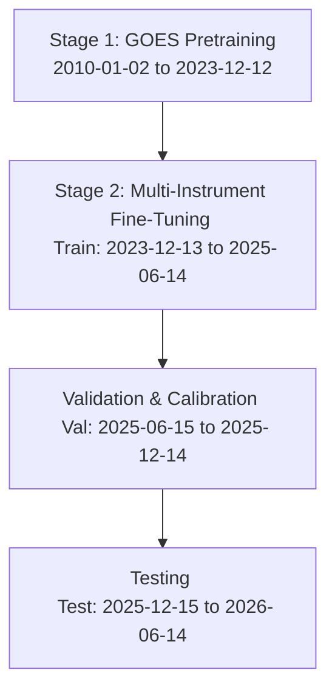

# Scientific Transfer Learning Protocol (Version 3)

This protocol describes the end-to-end training, validation, calibration, testing, and operator deployment workflow for the **Version 3 Late Fusion PatchTST** solar flare forecasting model. 

---

## 1. Protocol Overview

The protocol is designed to transfer representations learned from long-term, single-instrument historical observations (GOES) to a multi-instrument setup (GOES + SoLEXS + HEL1OS) without introducing temporal leakage. It consists of two sequential training stages followed by validation-based calibration and offline testing.

---

## 2. Stage 1: GOES-Only Pretraining

### Objective
Leverage historical single-instrument data spanning more than one full solar cycle to pretrain the GOES encoder and classification head. This allows the model to learn baseline temporal structures and solar flare precursor dynamics.

### Parameters and Timing
*   **Time Period:** 2010-01-02 to 2023-12-12
*   **Input Data:** GOES sequence only ($X_{\text{GOES}} \in \mathbb{R}^{B \times 360 \times 14}$)
*   **Missing Telemetry Representation:** SoLEXS and HEL1OS sequences are not provided. The model uses its learnable missing tokens (`missing_token_solexs` and `missing_token_hel1os`) for the projection paths of these two branches.
*   **Gradients:** Gradients flow strictly through:
    1.  GOES Encoder (`patch_embed_goes`, `pos_enc_goes`, `encoder_goes`, `norm_goes`, `pool_attn_goes`, `cls_token_goes`, `pool_query_goes`)
    2.  Common Fusion Layer (`fusion_attn`)
    3.  Classifier Head (`head`)
*   **Freezing Strategy:** SoLEXS and HEL1OS encoder weights are completely frozen or uninitialized during this stage.

### Optimization Configuration
*   **Loss Function:** Binary Cross-Entropy (BCE) with Logits Loss, weighted by class imbalance.
*   **Optimizer:** AdamW with `lr = 1e-4`, weight decay = `1e-2`.
*   **Scheduler:** Cosine annealing with linear warmup.
*   **Max Epochs:** 30 (early stopping when validation BCE loss plateaus for 5 epochs).

---

## 3. Stage 2: Multi-Instrument Fine-Tuning

### Objective
Integrate the high-resolution soft and hard X-ray observations from SoLEXS and HEL1OS. Align the pretrained GOES encoder with the newly initialized SoLEXS and HEL1OS encoders to make joint predictions.

### Parameters and Timing
*   **Time Period:** 2023-12-13 to 2025-06-14 (Train Split)
*   **Input Data:** 
    *   GOES ($100\%$ duty cycle)
    *   SoLEXS ($75.63\%$ duty cycle, otherwise masked)
    *   HEL1OS ($99.98\%$ duty cycle, otherwise masked)
*   **Gradients:** All encoder layers (`encoder_goes`, `encoder_solexs`, `encoder_hel1os`), projection layers (`proj_solexs`, `proj_hel1os`), learnable missing tokens, the fusion self-attention layer (`fusion_attn`), and the classifier head (`head`) receive gradients.

### Gradual Unfreezing Schedule
To avoid catastrophic forgetting of the pretrained GOES representations, we employ a progressive unfreezing schedule:

| Phase | Epochs | Unfrozen Parameters | Learning Rate | Rationale |
| :--- | :---: | :--- | :---: | :--- |
| **Phase 2.1** | 1–5 | SoLEXS/HEL1OS encoders, projections, missing tokens. (GOES encoder is frozen) | `3e-4` | Allow the new encoders to align their outputs with the pretrained fusion space. |
| **Phase 2.2** | 6–15 | All encoders, projections, fusion layers, and classifier head. | `5e-5` | Fine-tune the entire multi-instrument system end-to-end at a reduced rate. |

---

## 4. Validation

### Objective
Evaluate validation metrics to monitor model convergence, prevent overfitting, and perform hyperparameter selection.

### Parameters and Timing
*   **Time Period:** 2025-06-15 to 2025-12-14 (Validation Split)
*   **Methodology:** 
    *   Forward pass is evaluated on validation samples.
    *   Model weights corresponding to the **highest True Skill Statistic (TSS)** are preserved as `patchtst_best.pt`.
    *   Validation telemetry gaps (SoLEXS duty cycle $75.60\%$, HEL1OS duty cycle $99.98\%$) are handled via learnable missing tokens, matching real-world deployment.

---

## 5. Calibration

### Objective
Ensure that the output logits represent well-calibrated probabilities. Raw model probabilities are typically uncalibrated due to class imbalance and the binary cross-entropy objective.

### Calibration Protocol
*   **Fit Split:** Calibration mappings are fitted strictly on the **Validation split** predictions. 
*   **Method:** Isotonic Regression is the primary method due to the large sample size ($262,480$ validation rows), with Temperature Scaling as a fallback if the bin counts are small.
*   **Leakage Prevention:** Under no circumstances should Test split predictions or Train split predictions be used to fit the calibrator. The calibrator parameters (temperature or isotonic lookup table) must be locked before offline testing.

---

## 6. Testing

### Objective
Provide an unbiased estimate of generalization performance on a completely unseen future period.

### Parameters and Timing
*   **Time Period:** 2025-12-15 to 2026-06-14 (Test Split)
*   **Protocol:**
    *   Load the best checkpoint `patchtst_best.pt` and apply the locked calibrator.
    *   Inference is run statelessly on the test set.
    *   Report metrics: TSS, Brier Score, Precision, Recall, POD, POFD, FAR, ROC-AUC, and PR-AUC.

---

## 7. Operator Deployment

### Real-Time Inference
*   **Sliding Window:** At time $t$, the operator console ingests a sliding window of the last 360 minutes ($360 \times 1$-minute steps).
*   **Missing Instrument Fallback:**
    *   If a packet contains all three instruments, the model runs a standard forward pass.
    *   If SoLEXS or HEL1OS telemetry is missing (e.g., due to orbital night or spacecraft telemetry gaps), the respective active flag `mask_solexs` or `mask_hel1os` is set to `0.0`. The architecture replaces the pooled representations with the learnable `missing_token` parameter, enabling continuous, crash-free operation.
*   **Alert Generation:** Calibrated probabilities are compared against a locked operational threshold (e.g., $P_{\text{thresh}} = 0.35$). If $P \ge P_{\text{thresh}}$, an alert is sent to the operator console.
