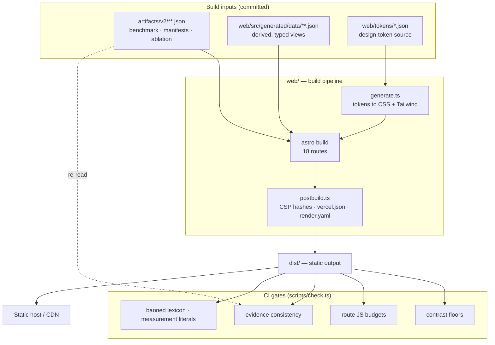
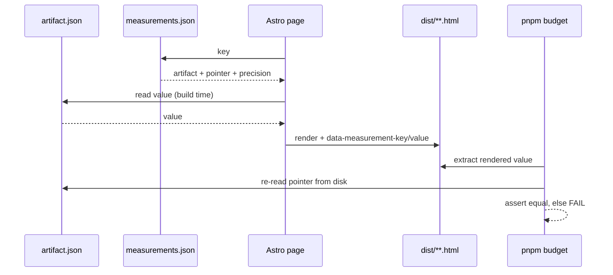
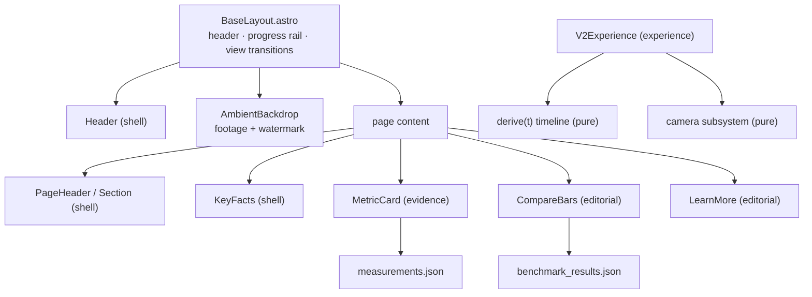

# Architecture

AdityaNet is a **fully static site** — no runtime server, no database, no user input. Every
response is a file produced at build time. This document explains how the pieces fit and,
more importantly, *why* the system is shaped this way. Decisions are recorded formally as
ADRs under [`adr/`](adr/); this is the narrative overview.

## System overview

## The evidence‑integrity pipeline

This is the core mechanism and the reason the platform can claim its numbers are checkable.

1. **Scientific artifacts are the single source of truth.** Frozen JSON under `artifacts/`
   and derived, typed views under `web/src/generated/data/`. These are committed and never
   edited by hand.
2. **A pointer registry** (`measurements.json`) maps a stable key to `{ artifact, JSON
   pointer, precision, unit }`. It says *where* to read a value, never the value itself.
3. **Astro renders at build time**, reading each value through its pointer and stamping the
   rendered element with `data-measurement-key` and `data-measurement-value`.
4. **`pnpm budget` closes the loop.** It scans the built HTML, and for every measurement it
   re‑reads the artifact from disk and asserts the rendered text equals the source, at the
   declared precision. Any drift fails the build.

The consequence: a wrong number cannot ship. Either the artifact is wrong (a scientific
matter, tracked separately) or the build fails.

## Why static

See [ADR‑0001](adr/0001-no-runtime-server.md). The site *is* evidence, and evidence should
be cacheable, independently hostable, and free of moving parts. A static bundle can be
served from any CDN indefinitely, mirrored, and archived. There is no server to exploit, no
runtime to keep alive, and no request that isn't enumerable in advance.

## Why Astro, and the island boundary

See [ADR‑0002](adr/0002-astro-over-nextjs.md). The decisive factor was a measurement: a
zero‑interaction page shipped **184 KB gz JS** under the Next App Router (React hydrates
everything) versus **0 bytes** under Astro's islands model. The project's evidence‑route
budgets were simply unachievable on the Next floor.

JavaScript is therefore spent only where interaction is genuine:

| Route | Island | Why it hydrates |
| --- | --- | --- |
| `/` | Landing scene (React + R3F + GSAP) | Scroll‑scrubbed video + WebGL compositing. |
| `/data` | Light curve (uPlot) | Interactive per‑day time series. |
| everything else | none | Static HTML; CSS‑only scroll choreography. |

ESLint import boundaries enforce the layering — evidence components cannot import
experience code, and vice versa — so the separation cannot erode by accident.

## Two rendering domains

See [ADR‑0003](adr/0003-two-rendering-domains.md). Content is split at the architecture
level into two registers that must never be confused:

- **Artistic (Domain A)** — illustrative footage (public‑domain NASA/SVS). Always
  watermarked `ILLUSTRATIVE · NASA / SVS · NOT ADITYA‑L1 DATA`. May be beautiful; claims
  nothing.
- **Measured (Domain B)** — traceable values. Carries no decorative post‑processing,
  because effects on a measurement would misrepresent its provenance.

## Component relationships

The `experience/v2` core — the `derive(t)` timeline and the camera subsystem — is pure and
unit‑tested (no roll, static shots provably static, monotonic certainty). Rendering reads
these; they never reach into rendering.

## Design tokens

See [ADR‑0004](adr/0004-generated-design-tokens.md). Colour and type live in
`web/tokens/*.json` and are emitted by `generate.ts` to both CSS custom properties and
Tailwind config. CI checks the generated files are current, so the two representations
cannot drift. Contrast floors (AAA, ≥ 7:1 body) are asserted against these same tokens.

## Further reading

- [`methodology.md`](methodology.md) — the science and evaluation protocol.
- [`deployment.md`](deployment.md) — hosting, CSP synchronisation, the failure modes solved.
- [`reproducibility.md`](reproducibility.md) — reproducing the dataset and the result.
- [`design-system.md`](design-system.md) — the visual language and editorial split.
- [`adr/`](adr/) — the formal decision records.
