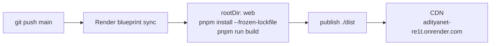

# Deployment

AdityaNet ships as a static bundle (`web/dist`) with a strict, hash‑based
Content‑Security‑Policy. It is deployed on **Render** (static site) and is also configured
for **Vercel**. There is no runtime server.

## Primary: Render

The repository contains a generated `render.yaml` blueprint at the root:

```yaml
services:
  - type: web
    name: adityanet
    runtime: static
    rootDir: web
    buildCommand: npm i -g pnpm@10.28.2 && pnpm install --frozen-lockfile && pnpm run build
    staticPublishPath: ./dist
    headers: [ … CSP · HSTS · nosniff · … ]
```

**Deploy:** Render Dashboard → **New → Blueprint** → connect `Rexy-5097/AdityaNet` → the
blueprint is read and applied. Every push to `main` redeploys.



## Header synchronisation — one source, three targets

Cloudflare's `_headers`, Vercel's grouped `vercel.json` headers, and Render's flat
`headers` use different syntaxes. To stop them drifting, **`postbuild.ts` generates all
three from the same resolved header text** produced during the build. The
Content‑Security‑Policy — including the build‑time SHA‑256 script hashes — is therefore
identical across hosts by construction. A regenerated config that differs is flagged so it
gets committed before deploying.

Verify the live policy:

```bash
curl -sSI https://adityanet-re1t.onrender.com/ | grep -i content-security-policy
```

## Failure modes solved (so they don't recur)

These were real deployment failures; each fix is encoded in configuration so it cannot
regress:

| Symptom | Cause | Fix |
| --- | --- | --- |
| Build compiled **pandas from source**, then failed | Host auto‑detected `requirements.txt` at the repo root and treated it as a Python project | `rootDir: web` — the docs are explicit that files outside the service root are unavailable at build time, so the Python project is hidden entirely |
| `npm error Cannot read properties of null (reading 'matches')` | The project has only a **pnpm** lockfile; npm cannot resolve it | Build with pnpm; pin `packageManager` and Node ≥ 22.12 |
| Vite `Rolldown failed to resolve @/generated/data/build/index.json` | An unanchored `build/` gitignore rule excluded committed **source** directories, so a clean checkout was not buildable | Anchor the rule to the repository root (`/build/`) |
| Site served with **no CSP** | `_headers` is Cloudflare syntax, ignored by Render/Vercel | Generate host‑native `render.yaml` / `vercel.json` from the same source |

The recurring lesson, encoded in the build: **verify against a clean `git archive` export,
not the working tree** — the working tree can contain files git does not, which is exactly
how the ignored‑source bug hid.

## Alternate: Vercel

`vercel.json` (repo root) and `web/vercel.json` are both generated, so a Vercel import works
whether the Root Directory is set to the repo root or to `web/`. The root config declares an
explicit `installCommand` / `buildCommand` that override framework auto‑detection.

## Served headers

Applied to every route:

- `Content-Security-Policy` — `default-src 'self'`; `script-src 'self'` + build‑time SHA‑256
  hashes; no `unsafe-inline`; no external origins; `object-src 'none'`; `frame-ancestors 'none'`.
- `Strict-Transport-Security` with `preload`.
- `X-Content-Type-Options: nosniff`, `Referrer-Policy`, `Cross-Origin-Opener-Policy`,
  `Cross-Origin-Resource-Policy`, `Permissions-Policy`.
- Hashed assets (`/_astro/*`) served `public, max-age=31536000, immutable`.

## Local production check

```bash
pnpm --dir web build
pnpm --dir web preview      # serve dist/ exactly as deployed
pnpm --dir web budget       # re-verify evidence consistency + route budgets
```
