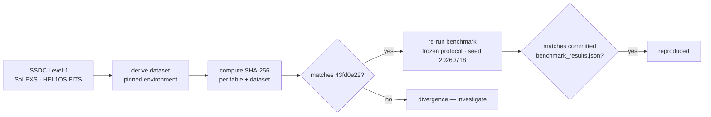

# Reproducibility

Reproducibility is the platform's core promise. There are two layers: the **website** is
reproducible from committed artifacts, and the **scientific result** is reproducible from
the raw archive. Both are described here.

## Layer 1 — the website reproduces from artifacts

The build is deterministic and self‑verifying. From a clean checkout:

```bash
pnpm --dir web install --frozen-lockfile
pnpm --dir web build
pnpm --dir web budget
```

`pnpm budget` re‑reads every committed artifact and asserts that each value rendered into
the HTML still equals its source, at the declared precision. If it passes, the site you
built is provably consistent with the artifacts under `artifacts/` and
`web/src/generated/data/`.

**Verify self‑containment** (the check that catches "works on my machine"): build from a
`git archive` export rather than the working tree.

```bash
git archive HEAD web | tar -x -C /tmp/adityanet-clean
cd /tmp/adityanet-clean/web
pnpm install --frozen-lockfile && pnpm run build   # must emit 18 routes
```

## Layer 2 — the scientific result reproduces from the archive

A researcher can reproduce the published numbers end to end.



### 1. Rebuild the dataset

Follow the pinned environment and steps published on
[`/build/reproduce`](https://adityanet-re1t.onrender.com/build/reproduce/), which lists the
per‑table inventory and the environment the freeze was produced in.

### 2. Verify integrity

Recompute the per‑table SHA‑256 digests and the dataset digest and compare against the
published values. **A correct rebuild is byte‑identical** — the freeze is deterministic, so
the dataset digest must equal `43fd0e228b28ae6bc7e468c3acf68722768bd62b73798eb6631e9e6233b71ed9`
(short `43fd0e22`). Any divergence is a signal to investigate, not to proceed.

### 3. Re‑run the benchmark

Run the evaluation under the frozen protocol:

- seed `20260718`
- time‑ordered test set from `2026-01-01 00:00:00+00:00`
- day‑block bootstrap 95% confidence intervals

Because the protocol was pre‑registered — fixed *before* any model was fit — it cannot be
retuned toward a different outcome.

### 4. Compare

Your `benchmark_results.json` should match the committed artifact under `artifacts/v2/ml/`.
The headline values to check:

| Quantity | Published value |
| --- | --- |
| Threshold ROC‑AUC (M/X nowcast) | 0.954 (CI 0.940–0.966) |
| Best learned model ROC‑AUC | 0.966 (CI 0.956–0.976) |
| Spectral‑band ablation Δ ROC‑AUC | +0.0033 |
| Verdict | no operational gain (intervals overlap) |

## What "reproducible" means here, precisely

- **Deterministic build** — same inputs produce the same `dist/` (byte‑stable except where
  a timestamp is intentionally embedded).
- **Digest‑addressed data** — the dataset is identified by its content hash, so "the data"
  is unambiguous.
- **Pre‑registered evaluation** — the protocol predates the models, removing the degree of
  freedom that lets a result be tuned.
- **Self‑verifying render** — the site cannot display a value that disagrees with its
  artifact without failing CI.

## Environment

- Node ≥ 22.12, pnpm (pinned to `pnpm@10.28.2` via `packageManager`).
- No network access is required to build the site — it reads only committed files.
- The scientific derivation uses a pinned Python environment recorded on the Build surface.

## Container image — pending verification

`research/Dockerfile` and `research/compose.yaml` pin the base image by version, install
only from `artifacts/v2/phase05/requirements.lock` after verifying the lockfile's digest,
and set `PYTHONHASHSEED=0` with single‑threaded BLAS so determinism is not thread‑order
dependent.

> **The Docker configuration has been authored and statically validated but has not yet
> been executed in a real container runtime.**

No image has been built here, so no claim is made that it works. It is published in this
state rather than withheld — an unbuilt Dockerfile that says so is useful to someone with a
runtime, whereas a green checkmark on something nobody has executed would undermine every
other claim on this page.

## Case study — the lockfile digest that did not match

The freeze manifest records a SHA‑256 for `requirements.lock`. **It does not match the file
on disk.** Taken at face value, that is the worst thing this project could discover: the
environment record disagreeing with the environment.

It is not drift. The chain, computed at build time by `web/scripts/derive.py` and published
at [`/reproducibility#lockfile`](https://adityanet-re1t.onrender.com/reproducibility/#lockfile):

| Stage | What happened | Result |
| --- | --- | --- |
| Dataset freeze | Canonical dataset built and frozen at `be0b7e5` | `freeze_manifest.json` |
| Frozen lockfile | Manifest records the digest of the environment used — 92 pinned packages | `6899e001…` |
| Benchmark expansion | Months later the flare benchmark runs; it needs gradient boosting and SHAP | `benchmark_results.json` |
| Additional dependencies | 7 packages appended to the *same* lockfile at `9efad0c` | 99 pinned packages |
| Final runtime | The file now describes the benchmark environment, not the freeze environment | `8187301e…` |

Re‑hashing the lockfile blob as it existed at `be0b7e5` reproduces the recorded digest
exactly, and diffing the package sets names the seven additions
(`lightgbm`, `shap`, `numba`, `llvmlite`, `cloudpickle`, `slicer`, `tqdm`). One lockfile
served two environments at two points in history, and only the first was hashed.

**Why this is expected.** A lockfile is a living description of a working environment; a
manifest digest is a dated claim about one moment. They diverge the first time a project
does something new with the same data — for a research repository, the normal path.

**Why provenance mattered.** Without the recorded build commit, the only available reading
of a digest mismatch is that the environment record is untrustworthy, and the honest
response would have been to withdraw the reproducibility claim. Because the manifest
records `be0b7e5`, the question was answerable by computation. The system produced a
correct alarm and then produced its own explanation.

**What was not done.** The manifest was not quietly re‑hashed to make the mismatch go away.
It records what the *dataset* was built with, which is the question it exists to answer. An
integrity system whose alarms are silenced to keep a page green is decorative.

## Reproducibility metrics

Published at [`/reproducibility`](https://adityanet-re1t.onrender.com/reproducibility/) and
derived from committed artifacts. Deliberately **not** throughput, latency or scalability:
this platform serves a frozen dataset from static files, so it has no ingestion loop and no
query service to benchmark, and inventing those figures would discredit the page.

| Metric | State | Measured value |
| --- | --- | --- |
| Environment reproducibility | Partial | 99 packages pinned; digest mismatch explained above |
| Artifact integrity | Verified | 1,985 / 1,985 files carry their own SHA‑256 |
| Dataset provenance | Verified | Row‑level source attribution (`src_file` + `src_sha256`) |
| Build determinism | Partial | 24 / 24 comparisons byte‑identical, over a 12‑day sample |
| Validation coverage | Partial | 5 of 6 contradictions closed; the open one published as open |
| Evidence traceability | Verified | Every governed measurement resolves to artifact, pointer, digest, commit |

Two of the six report as partial, and one component reports as pending verification. That
is the point: the value of this page is entirely that it can be trusted about its own
limits.
