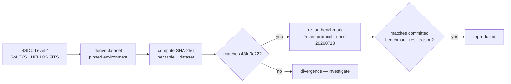

# Reproducibility

Reproducibility is the platform's core promise. There are two layers: the **website** is
reproducible from committed artifacts, and the **scientific result** is reproducible from
the raw archive. Both are described here.

## Layer 1 — the website reproduces from artifacts

The build is deterministic and self‑verifying. From a clean checkout:

```bash
pnpm --dir web install --frozen-lockfile
pnpm --dir web build
pnpm --dir web budget
```

`pnpm budget` re‑reads every committed artifact and asserts that each value rendered into
the HTML still equals its source, at the declared precision. If it passes, the site you
built is provably consistent with the artifacts under `artifacts/` and
`web/src/generated/data/`.

**Verify self‑containment** (the check that catches "works on my machine"): build from a
`git archive` export rather than the working tree.

```bash
git archive HEAD web | tar -x -C /tmp/adityanet-clean
cd /tmp/adityanet-clean/web
pnpm install --frozen-lockfile && pnpm run build   # must emit 18 routes
```

## Layer 2 — the scientific result reproduces from the archive

A researcher can reproduce the published numbers end to end.



### 1. Rebuild the dataset

Follow the pinned environment and steps published on
[`/build/reproduce`](https://adityanet-re1t.onrender.com/build/reproduce/), which lists the
per‑table inventory and the environment the freeze was produced in.

### 2. Verify integrity

Recompute the per‑table SHA‑256 digests and the dataset digest and compare against the
published values. **A correct rebuild is byte‑identical** — the freeze is deterministic, so
the dataset digest must equal `43fd0e228b28ae6bc7e468c3acf68722768bd62b73798eb6631e9e6233b71ed9`
(short `43fd0e22`). Any divergence is a signal to investigate, not to proceed.

### 3. Re‑run the benchmark

Run the evaluation under the frozen protocol:

- seed `20260718`
- time‑ordered test set from `2026-01-01 00:00:00+00:00`
- day‑block bootstrap 95% confidence intervals

Because the protocol was pre‑registered — fixed *before* any model was fit — it cannot be
retuned toward a different outcome.

### 4. Compare

Your `benchmark_results.json` should match the committed artifact under `artifacts/v2/ml/`.
The headline values to check:

| Quantity | Published value |
| --- | --- |
| Threshold ROC‑AUC (M/X nowcast) | 0.954 (CI 0.940–0.966) |
| Best learned model ROC‑AUC | 0.966 (CI 0.956–0.976) |
| Spectral‑band ablation Δ ROC‑AUC | +0.0033 |
| Verdict | no operational gain (intervals overlap) |

## What "reproducible" means here, precisely

- **Deterministic build** — same inputs produce the same `dist/` (byte‑stable except where
  a timestamp is intentionally embedded).
- **Digest‑addressed data** — the dataset is identified by its content hash, so "the data"
  is unambiguous.
- **Pre‑registered evaluation** — the protocol predates the models, removing the degree of
  freedom that lets a result be tuned.
- **Self‑verifying render** — the site cannot display a value that disagrees with its
  artifact without failing CI.

## Environment

- Node ≥ 22.12, pnpm (pinned to `pnpm@10.28.2` via `packageManager`).
- No network access is required to build the site — it reads only committed files.
- The scientific derivation uses a pinned Python environment recorded on the Build surface.
